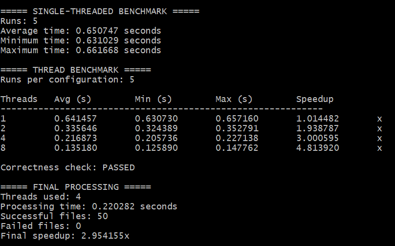
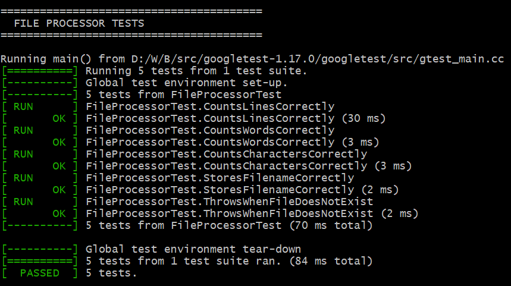
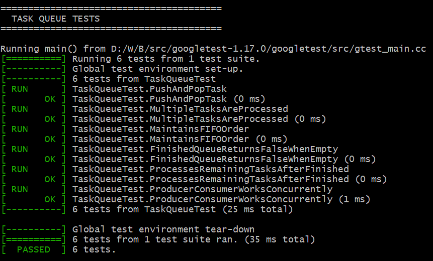
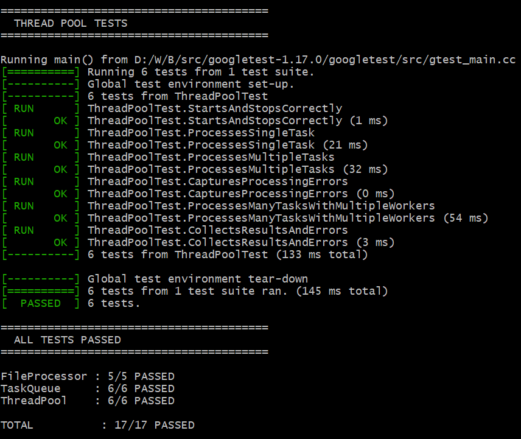

# Multithreaded File Processor

A C++17 application for concurrent text-file processing using a **Thread Pool** and **Producer-Consumer** architecture.

The system processes files concurrently, calculates file statistics, handles processing errors, validates correctness, and benchmarks performance across different thread configurations.

## Key Features

- C++17 multithreaded file processing
- Thread Pool architecture using `std::thread`
- Producer-Consumer task queue
- Thread synchronization using `std::mutex` and `std::condition_variable`
- Worker-local result and error storage
- Exception handling
- Single-threaded vs. multithreaded benchmarking
- 5-run performance benchmarking
- Correctness validation
- GoogleTest unit testing
- CSV-based result and benchmark reporting

## Architecture

```text
                    main.cpp
                       |
                Discover Files
                       |
             +---------+---------+
             |                   |
             v                   v
     Single-Threaded        Thread Pool
        Processor               |
             |              Task Queue
             |                   |
             |          +--------+--------+
             |          |        |        |
             |       Worker   Worker   Worker
             |          |        |        |
             |          +--------+--------+
             |                   |
             |             FileProcessor
             |                   |
             +---------+---------+
                       |
                Correctness Check
                       |
              +--------+--------+
              |                 |
          results.csv     benchmark_results.csv
```

## Project Structure

```text
MultithreadedFileProcessor/
│
├── images/
│   ├── Main_Benchmark.png
│   ├── FileProcessor_Test.png
│   ├── TaskQueue_Test.png
│   └── ThreadPool_Test.png
│
├── src/
│   ├── Benchmark.*
│   ├── CSVWriter.*
│   ├── FileProcessor.*
│   ├── SingleThreadProcessor.*
│   ├── TaskQueue.*
│   ├── ThreadPool.*
│   └── main.cpp
│
├── tests/
│   ├── FileProcessorTest.cpp
│   ├── TaskQueueTest.cpp
│   └── ThreadPoolTest.cpp
│
├── input/
├── benchmark_input/
├── benchmark_results/
├── output/
├── run_tests.bat
├── .gitignore
└── README.md
```

## Performance Benchmark

The application runs each configuration **5 times** and reports average, minimum, maximum execution time, and speedup.



### Benchmark Results

| Threads | Average Time (s) | Speedup |
|--------:|-----------------:|--------:|
| 1 | 0.641457 | 1.01× |
| 2 | 0.335646 | 1.94× |
| 4 | 0.216873 | 3.00× |
| 8 | 0.135180 | 4.81× |

The final processing run used **4 worker threads** and processed **50 files successfully** with **0 failures**.

```text
Correctness check: PASSED
Final speedup: 2.95x
```

> Performance varies depending on hardware, filesystem, workload, and system load.

Benchmark results are automatically saved to:

```text
benchmark_results/benchmark_results.csv
```

## Correctness

Multithreaded results are compared against the single-threaded baseline to verify:

- Filename
- Line count
- Word count
- Character count

```text
Correctness check: PASSED
```

## Unit Testing

GoogleTest is used for automated testing.

### File Processor Tests

Tests validate file statistics and error handling.



### Task Queue Tests

Tests validate task insertion, retrieval, ordering, completion handling, and producer-consumer behavior.



### Thread Pool Tests

Tests validate worker startup/shutdown, task processing, error handling, multiple-worker processing, and result collection.



### Test Summary

| Test Suite | Tests | Result |
|---|---:|---|
| FileProcessor | 5/5 | PASSED |
| TaskQueue | 6/6 | PASSED |
| ThreadPool | 6/6 | PASSED |
| **Total** | **17/17** | **PASSED** |

## Build

### Requirements

- Windows
- C++17
- GCC / MinGW
- MSYS2 UCRT64
- GoogleTest

Compile:

```bash
g++ -std=c++17 \
src/main.cpp \
src/FileProcessor.cpp \
src/TaskQueue.cpp \
src/ThreadPool.cpp \
src/SingleThreadProcessor.cpp \
src/Benchmark.cpp \
src/CSVWriter.cpp \
-I./src \
-o file_processor.exe
```

Run:

```bash
./file_processor.exe
```

## Run Tests

From MSYS2 UCRT64:

```bash
cmd.exe /c run_tests.bat
```

Expected result:

```text
FileProcessor : 5/5 PASSED
TaskQueue     : 6/6 PASSED
ThreadPool    : 6/6 PASSED

TOTAL         : 17/17 PASSED
```

## Output

```text
output/
├── results.csv
└── errors.log

benchmark_results/
└── benchmark_results.csv
```

- **MSYS2 UCRT64**
- **CSV**
